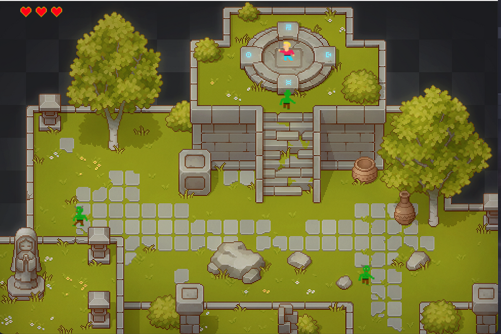

# WonderPaul

Simple 2D Game base on ```Javax.Swing``` implemented in [Scala](https://www.scala-lang.org).

The background image has been copy from this [link](https://cainos.itch.io/pixel-art-top-down-basic)

All Sprites has been implemented using [piskelapp](https://www.piskelapp.com/) webpage.

# 


## How to Play

Clone the repo, and run ```Main``` class

## Keyboard

 ```Up, Down, Left, Right``` keyboards to move

```space``` to fire

